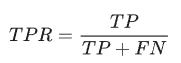

# Machine Learning Cheatsheet

## The idea behind this cheatsheet is to learn the basis of ML, some of the terminology and techniques used in ML.

- ## What is Machine Learning ?
Machine Learning is a field of study that gives computers ability to leran without being explicitly programmed. 
Another definition is: A computer program is said to learn from experience E with respect of some task T and some performance measure P, if its performance on T, as measured by P, improves with experience E.

- ## How can we classify the types of Machine Learning Systems ?
There are different type of classifications of types of Machine Learning Systems:
### Whether or not they are trained with human supervision:
- Supervised learning
- Unsupervised learning
- Semisupervised learning
- Reinforcement learning

### Whether or not they can learn incrementally on fly:
- Online learning
- Batch learning

### Whether they work by simply comparing new data point to new data points or instead detect patterns in the trainig data and build a predictive model:
- Instance-based learning
- Model-based learning

- ## Shortly describe the Supervised learning. 
Supervised learning is a machine learning task of learning a function that maps an input to an output based on example input-output pairs. Basically there are two types of supervised learning tasks based on the output labeled data:
- Classification
- Regression

### Classification
If the output data(or variable) is category(so it's needed to predict some category), then it's a classification problem. The output data is called class and it can be some target/label or  category. For example Yes/No, 1/0 or Red/Blue/Yellow, etc.

### Regression
If the output data(or variable) is a target numeric value(so it's needed to predict some number) then it's a regression problem. For example price of car, price of stock, etc.

Most important supervised learning algorithms are: 
- k-Nearest Neighbors
- Linear Regression
- Logistic Regression
- Support Vector Machines (SVMs)
- Decision Trees and Random Forests

- ## Shortly describe the Unsupervised learning.
Unsupervised learning is a machine learning task where the learing is based on unlabeled data. Basically there are two types of unsupervised learning tasks:
- Clustering
- Association

- ## Shortly describe the Semisupervised learning.
Semi-supervised learning is an approach to machine learning that combines a small amount of labeled data with a large amount of unlabeled data during training. Semi-supervised learning falls between unsupervised learning (with no labeled training data) and supervised learning (with only labeled training data).

- ## Shortly describe the Reinforcement learning.
Reinforcement Learning is a very different beast. The learning system, called an agent in this context, can observe the environment, select and perform actions, and get rewards in return (or penalties in the form of negative rewards).

- ## 10 Stages of a Machine Learning project:
1) Problem definition
2) Research
3) Data collection, aggregation, scrapping
4) Data preparation, preprocessing, augmentation
5) Model implementation
6) Training
7) Evaluation
8) Parameter tuning
9) Model conversion – mobile, cloud...
10) Model deployment

- ## Describe Support Vector Machine(SVM) algorithm
SVM are linear classifiers that find a hyperplane to separate two classes of data, a positive class and a negative class. SVM can also classify nonlinearly separable
data with the use of the so called kernel trick. They are one of the most accurate methods of classification, especially for text classification, but they can be used for regression and classification problems. The SVM algorithms work only for two-class problems, for multi-class there can be some problems. The idea behind SVM is to find the optimal hyperplane. Points(data) that is the closest to the line(hyperplane) is called support vector. The distance between the support vector and the line is called margin. The goal of SVM is maximaze the margin. So hyperplane for which the margin is maximum is called optimal hyperplane.

 
- ## Describe K-Nearest Neigbors algorithm(KNN)
KNN is one of the simplest Machine Learning algorithms based on Supervised Learning technique. KNN algorithm assumes the similarity between the new case/data and available cases and put the new case into the category that is most similar to the available categories. KNN algorithm stores all the available data and classifies a new data point based on the similarity. This means when new data appears then it can be easily classified into a well suite category by using KNN algorithm. KNN algorithm can be used for Regression as well as for Classification but mostly it is used for the Classification problems. KNN is a non-parametric algorithm, which means it does not make any assumption on underlying data. It is also called a lazy learner algorithm because it does not learn from the training set immediately instead it stores the dataset and at the time of classification, it performs an action on the dataset. KNN algorithm at the training phase just stores the dataset and when it gets new data, then it classifies that data into a category that is much similar to the new data. So the basic idea for the KNN is to classify things based on their distance from something that has already known class. There are different metrics on how the distance is computed:
- Euclidean distance
- Manhattan distance
- Minkows
- Cosine similarity, etc.

KNN class determination is done usually with voting(majority or weighted). The calculation of the value of k is crucial:
- Small K -> small regions for each class = higher variance
- Big K -> larger regions for each class = higher bias
Usually the "perfect" k is calculated as k=sqrt(number_of_elements_dataset)

- ## Describe Logistic Regression algorithm
Logistic Regression algorithm is a typical supervised learning algorithm. It is used to calculate or predict the probability of a binary event occurring(YES/NO, 1/0...) Logistic regression is used to solve classification problems, and the most common use case is binary logistic regression, where the outcome is binary (yes or no). There are three types of logistic regression:
- Binary logistic regression - When we have two possible outcomes
- Multinomial logistic regression - When we have multiple outcomes
- Ordinal logistic regression - When the outcome is ordered
Logistic regression is using a threshold value, so everything below that value is classified as 0 and everything above that value is classified as 1.

- ## Describe Decision Tree algorithm
The decision tree Algorithm belongs to the family of supervised machine learning algorithms. It can be used for both a classification problem as well as for regression problem. The goal of this algorithm is to create a model that predicts the value of a target variable, for which the decision tree uses the tree representation to solve the problem in which the leaf node corresponds to a class label and attributes are represented on the internal node of the tree. This is the most simple supervised machine learning algorithm. Example of this algorithm can be seen on this picture:

- ## Linear Regression algorithm
Linear regression is one of the easiest and most popular Machine Learning algorithms. It is a statistical method that is used for predictive analysis. Linear regression makes predictions for continuous/real or numeric variables such as sales, salary, age, product price, etc.Linear regression algorithm shows a linear relationship between a dependent (y) and one or more independent (y) variables, hence called as linear regression. Since linear regression shows the linear relationship, which means it finds how the value of the dependent variable is changing according to the value of the independent variable.

Linear regression can be further divided into two types of the algorithm:
- Simple Linear Regression-If a single independent variable is used to predict the value of a numerical dependent variable, then such a Linear Regression algorithm is called Simple Linear Regression.
- Multiple Linear regression- If more than one independent variable is used to predict the value of a numerical dependent variable, then such a Linear Regression algorithm is called Multiple Linear Regression

- ## Explain Validation techniques
Validation techniques are used to get the error rate of the model as close to the true error rate of the population. If the data is large enought to be representative od the population, the validation techniquest will be not needed. But in the real world that's not the case and the sample of data with which is worked may not represent the population. The larger the test data the more accurate the error estimate is. There are different validation techniques:
- Training data
- Hold-out (Stratification)
- K-fold cross-validation(CV)
- Leave one CV
- Random subsampling
- Bootstrapping 
- Train-Validation-Test

### Training data
Training data validation technique is when all the training data is used for validation, to be exact is used to estimate the performance of the model. The accuracy/error estimates on the training data are not good indication of the performance on future data. Because new data will probably not be exactly the same as the training data. The accuracy/erro estimates on the training data measure the degree of classifier's overfitting

### Hold-out (Stratification)
Usually the dataset is divided into two different datasets labeled as train and test datasets. The ratio of the splits(percentage splits) can be different but usually it's 60/40, 70/30 or 80/20. But theres a catch, uneven distribution of different classes of the data can be found in the training and test dataset. So to fix that, the training and test dataset is created with equal distribution of different classes of data. This is called stratification.

### K-fold cross-validation
So the idea behind k-fold cross-validation is to get the whole dataset and to split the dataset on k instances and to train+test on these instances. So the error rate will be different for every instance and the final error rate will be the average of all the error rates. This can be improved by using stratification technique

### Leave-One-Out Cross-Validation
All the data except one instance is used for training and the left one instance is used for testing. This process is repeated for N times if there are N records. The advantage is that entire data is used for training and testing. The error rate of the model is average of the error rate of each iteration.

### Random Supsampling
Multiple instances are randomly chosen from the dataset and combined to form a test dataset. The remaining data forms the training dataset. The error rate of  the model is the average of the error rate of each iteration.

### Bootstrapping
The training dataset is randomly selected with replacement. The remaining examples that were not selected for training are used for testing. Unlike K-fold cross-validation, the value is likely to change from fold-to-fold.The error rate of the model is average of the error rate of each iteration.

### Train-Validation-Test
The data is split in 3 parts, train for training the model, validation to validate the model and adjust parameters(usually useful for hyperparameter otpimization, meta-learning, etc.) and test to test the model and estimate it's performance. The ratio(procentage split) is usually 70/20/10.

For extremely big datasets, test sets and hold-out method can be use for validation. For medium sized datasets k-fold CV is the best method. For small datasets leave-one-out adn bootstrap methods are excellent.

- ## Evaluation metrics
Evaluation metrics are used to determine what features contribute to the overall performance, which feature is better than some other feature and etc. There are a lot of evaluation metrics but the most important are:
- Accuracy/Error rate
- Baseline classifiers(for test purposes)
- Confusion Matrix
- Precission and Recall
- F-Measure
- Sensitivity and Specificity
- ROC curves

### Accuracy/Error rate
Accuracy is the most common and intuitive measure for classification problem performance. The formula for accuracy is: 
Accuracy = correct_predictions / number_of_entries
The error rate is basically the reverse of accuracy and it can be calculated as:
error_rate = 1-accuracy

### Baseline classifiers
Often used as benchmarks or with other words "we can do better than that". For example ZeroR classifier is used to see which class is the most frequent one in the dataset.

### Confusion matrix
Confusion matrix gives us how many of the prediction were predicted correctly. There are two versions of the confusion matrix:
-For binary class cases
-For multiclass cases
From the confusion matrix all other evaluation matrics can be calculated.

- ### Binary-class cases

- ### Multi-class cases

- ### Contingency table

### Precission and Recall

- ### Precision 
Precision is basically how many hypothesized events were true events

- ### Recall
Recall is basically how many of the true events were identified

### F-Measure(F1-Measure)
F-Measure is harmonic mean of precision and recall. F-measure can be weighted to favor precision or recall.

F1-Measur or metric is when beta equals 1. There are two types of F-Measures:
- Macro (simple average)
- Micro (weighted average)

### Sensitivity and Specificity (need picture)

### ROC curves(need picture)
An ROC curve (receiver operating characteristic curve) is a graph showing the performance of a classification model at all classification thresholds. This curve plots two parameters:
- True Positive Rate(Recall)
- False Positive Rate

An ROC curve plots TPR vs. FPR at different classification thresholds. Lowering the classification threshold classifies more items as positive, thus increasing both False Positives and True Positives. The following figure shows a typical ROC curve.

- ## Types of Errors
There are two types of errors that can occur:
- False Positives
- False Negatives

### False Positives
The system predicted TRUE but the value was FALSE.This is also known as “False Alarms” or Type I error.

### False Negatives
The system predicted FALSE but the value was TRUE. This is also known as “Misses” or Type II error.

- ## Overfitting and Underfitting
Overfitting occurs when our machine learning model tries to cover all the data points or more than the required data points present in the given dataset. Because of this, the model starts caching noise and inaccurate values present in the dataset, and all these factors reduce the efficiency and accuracy of the model. The overfitted model has low bias and high variance.

### Overfitting
Overfitting occurs when the machine learning model tries to cover all the data points or more than the required data points present in the given dataset. Because of this, the model starts caching noise and inaccurate values present in the dataset, and all these factors reduce the efficiency and accuracy of the model. The overfitted model has low bias and high variance. The chances of occurrence of overfitting increase as much we provide training to our model. It means the more we train our model, the more chances of occurring the overfitted model. Overfitting is the main problem that occurs in supervised learning.

### Underfitting
Underfitting occurs when our machine learning model is not able to capture the underlying trend of the data. To avoid the overfitting in the model, the fed of training data can be stopped at an early stage, due to which the model may not learn enough from the training data. As a result, it may fail to find the best fit of the dominant trend in the data. In the case of underfitting, the model is not able to learn enough from the training data, and hence it reduces the accuracy and produces unreliable predictions. An underfitted model has high bias and low variance.

- ## Explain Bias and Variance
Bias and variance are inversely connected. It is impossible to have an ML model with a low bias and a low variance.

### Bias
Bias is a phenomenon that skews the result of an algorithm in favor or against an idea. Bias is considered a systematic error that occurs in the machine learning model itself due to incorrect assumptions in the ML process. Technically, we can define bias as the error between average model prediction and the ground truth. Moreover, it describes how well the model matches the training data set:
- A model with a higher bias would not match the data set closely.
- A low bias model will closely match the training data set.

Characteristics of a high bias model include:
- Failure to capture proper data trends
- Potential towards underfitting
- More generalized/overly simplified
- High error rate

### Variance
Variance refers to the changes in the model when using different portions of the training data set. Simply stated, variance is the variability in the model prediction—how much the ML function can adjust depending on the given data set. Variance comes from highly complex models with a large number of features.
- Models with high bias will have low variance.
- Models with high variance will have a low bias.
All these contribute to the flexibility of the model. For instance, a model that does not match a data set with a high bias will create an inflexible model with a low variance that results in a suboptimal machine learning model.

Characteristics of a high variance model include:
- Noise in the data set
- Potential towards overfitting
- Complex models
- Trying to put all data points as close as possible

- ## Describe the trade-off Bias vs Variance
Bias and variance are inversely connected. It is impossible to have an ML model with a low bias and a low variance.

When a data engineer modifies the ML algorithm to better fit a given data set, it will lead to low bias, but it will increase variance. This way, the model will fit with the data set while increasing the chances of inaccurate predictions. The same applies when creating a low variance model with a higher bias. While it will reduce the risk of inaccurate predictions, the model will not properly match the data set. It’s a delicate balance between these bias and variance. Importantly, however, having a higher variance does not indicate a bad ML algorithm. Machine learning algorithms should be able to handle some variance. To combat this:
- Increasing the complexity of the model to count for bias and variance, thus decreasing the overall bias while increasing the variance to an acceptable level. This aligns the model with the training dataset without incurring significant variance errors.
- Increasing the training data set can also help to balance this trade-off, to some extent. This is the preferred method when dealing with overfitting models. Furthermore, this allows users to increase the complexity without variance errors that pollute the model as with a large data set.
- A large data set offers more data points for the algorithm to generalize data easily. However, the major issue with increasing the trading data set is that underfitting or low bias models are not that sensitive to the training data set. Therefore, increasing data is the preferred solution when it comes to dealing with high variance and high bias models.

- ## Ensemble learning

Ensemble models is a machine learning approach to combine multiple other models in the prediction process. Those models are referred to as base estimators. It is a solution to overcome the following technical challenges of building a single estimator:
- High variance: The model is very sensitive to the provided inputs to the learned features.
- Low accuracy: One model or one algorithm to fit the entire training data might not be good enough to meet expectations.
- Features noise and bias: The model relies heavily on one or a few features while making a prediction.

There are three types of ensemble learning:
- Combining classifier decisions
- Bagging
- Boosting

### Combining classifier decisions
As the name says is about combining all the decisions of individual classifiers. There are basically three types:
- Majority voting-where the decision is made by who has the most votes
- Weighted voting-where every vote(classifier) has it's on weight(additional number) which number usually is the accuracy of that classifier
- Stacking-where the predictions of all the classifiers are used as input to another classfier.

### Bagging
The idea of bagging is based on making the training data available to an iterative process of learning. Each model learns the error produced by the previous model using a slightly different subset of the training dataset. Bagging reduces variance and minimizes overfitting.Bagging is based on a bootstrapping sampling technique. Bootstrapping creates multiple sets of the original training data with replacement. Replacement enables the duplication of sample instances in a set. Each subset has the same equal size and can be used to train models in parallel. Random Forest Algorithm is using the bagging method.

### Boosting
There are two types of boosting algorithms:
- Adaptive Boosting
- Gradient Boosting

- ### Adaptive Boosting(AdaBoost)
Adaptive Boosting (AdaBoost) is an ensemble of algorithms, where we build models on the top of several weak learners. As we mentioned earlier, those learners are called weak because they are typically simple with limited prediction capabilities. The adaptation capability of AdaBoost made this technique one of the earliest successful binary classifiers. Sequential decision trees were the core of such adaptability where each tree is adjusting its weights based on prior knowledge of accuracies. Hence, we perform the training in such a technique in sequential rather than parallel process. In this technique, the process of training and measuring the error in estimates can be repeated for a given number of iteration or when the error rate is not changing significantly.

- ### Gradient Boosting
Gradient boosting algorithms are great techniques that have high predictive performance. XGBoost, LightGBM and CatBoost are popular boosting algorithms that can be used for regression and classification problems.
